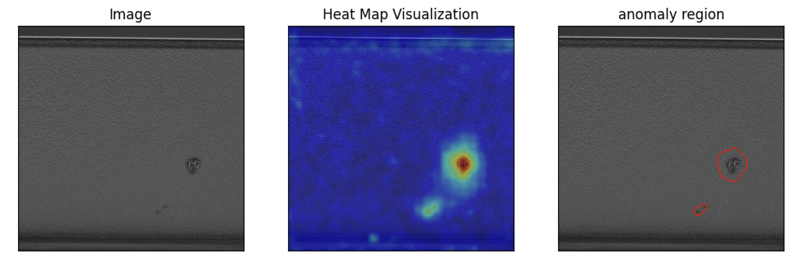
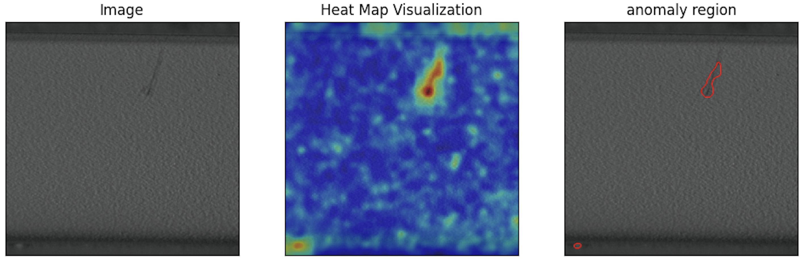

# Image-Based Anomaly Detection Using Deep Learning




## Requirements
- python == 3.7
- pytorch == 1.5
- tqdm
- sklearn
- matplotlib
- pillow

You can install the requirement by running:
```
pip install -r requirement.txt
```
## Datasets
Your dataset folder should be saved as the structure belows:
```
  data    
    └───object
            ├──train
            │   ├── normal
            │   │       ├── normal_000001.png
            │   │       ├── normal_000002.png
            │   │       └── ...
            └───test
                ├── normal
                │       ├── normal_000001.png
                │       ├── normal_000002.png
                │       └── ...
                └─── anomaly
                        ├── anomaly_000001.png
                        ├── anomaly_000002.png
                        └── ...
```

## Training
```
python train.py
```
## Acknowledgments
This code borrows heavily from: https://github.com/xiahaifeng1995/PaDiM-Anomaly-Detection-Localization-master
